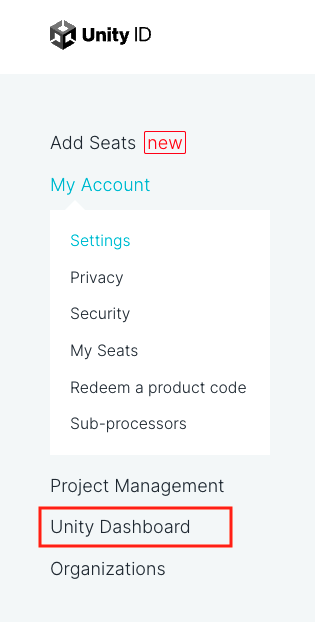

## Setup Unity Account

Unity Computer Vision Datasets (UCVD) service provides data generation at scale on Cloud. To use UCVD, you are asked to have a Unity project associated with a Unity ID and organization. If you have already had a Unity organization and a project, you can proceed to the [data generation](dataset-generation-and-configuration.md).

### Create a Unity ID

> Note: You can skip this step if you have already had a Unity account.

1. Go to [create a new Unity ID](https://id.unity.com/account/new)

1. Fill and submit the form to create your Unity ID

	> Note: Please make sure to read and accept Unity's Terms of Use and Privacy Policy before proceeding. More details of instructions can be found on the [Unity support website](https://support.unity.com/hc/en-us/articles/208626336-How-do-I-create-a-Unity-ID-account-)

### Sign into your Unity ID

1. Go to [Unity ID](https://id.unity.com)

1. Sign into your Unity ID

### Create a New Organization

> Note: you can skip this step if you want to use an existing organization to generate the datasets on UCVD.

> Note: More detailed instructions can be found on the [Unity support website](https://support.unity.com/hc/en-us/articles/208592876-How-do-I-create-a-new-Organization-)

1. Click the **Organizations** on the left column of the webpage

1. Click the **Add new** button

1. Enter the name of your new organization and click the **Create** button.

### Create a New Project

> Note: you can skip this step if you are using an existing project to generate the datasets on UCVD

1. Click the **Unity Dashboard** in the left of the column in your [Unity ID webpage](https://id.unity.com)

	

1. Click the **Project** on the left column of the dashboard, and then click the **Create** button.

	

1. Enter the name of your new project and click the **Create project** button

### Setup UCVD Auth
   1. Follow [UCVD Guide](http://doesnot-exist-yet.com) to get the API Token. You will be using this for UCVD APIs.
   2. Generate a dataset on UCVD # TODO: switch over to SDK later
   3. Get the runID, and set it to the environment variable `UNITY_CVD_RUN_ID`.
   4. Make sure you have the real world data from [here]() in `data/real/`.

---

### Proceed to [Data Generation](dataset-generation-and-configuration.md)
